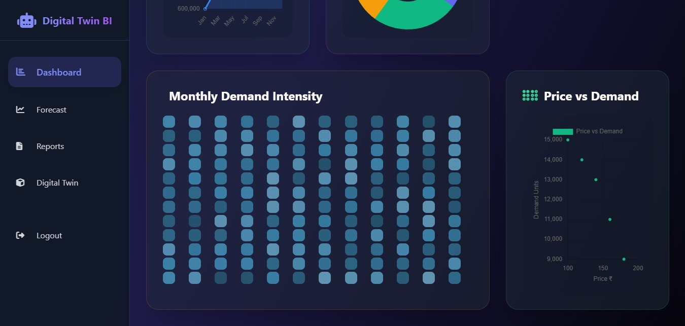
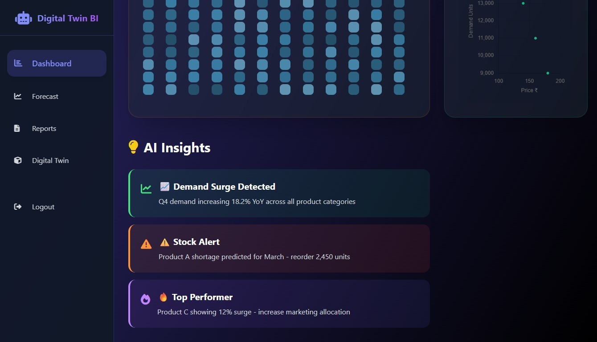
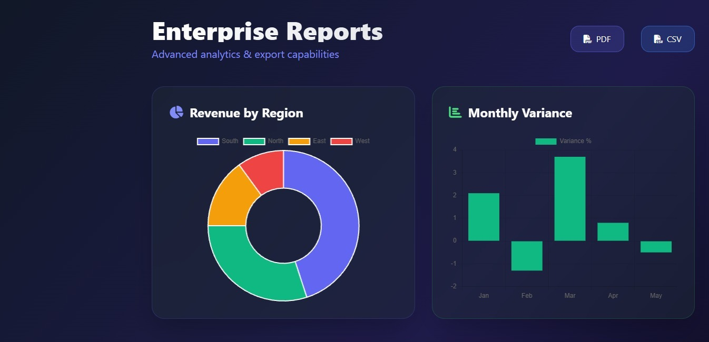
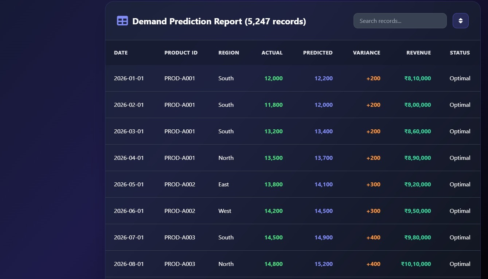

# 🚀 SalesMind DTBI

AI-Based Digital Twin Business Intelligence & Demand Prediction System

---

## 🔥 Features
- AI-powered demand forecasting
- Digital Twin simulation
- What-if analysis
- Inventory intelligence
- REST API architecture
- Modular ML model integration

---

## 🧠 Models Used
- Demand Prediction Model
- Business Intelligence Model
- Digital Twin Simulation Engine

---

## 🛠 Tech Stack
- Python
- Flask
- Machine Learning
- REST APIs

--

## ▶ How to Run

pip install -r requirements.txt

python app.py

# SalesMind AI - Dashboard

## 🏗 System Architecture

