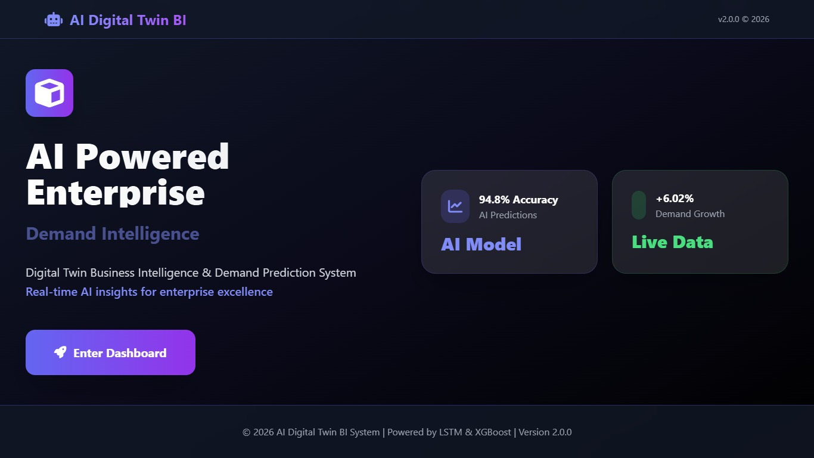
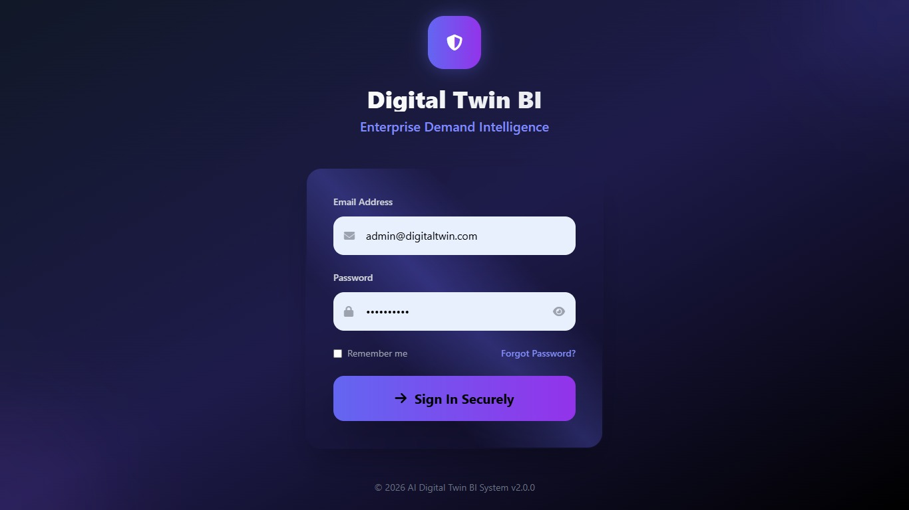
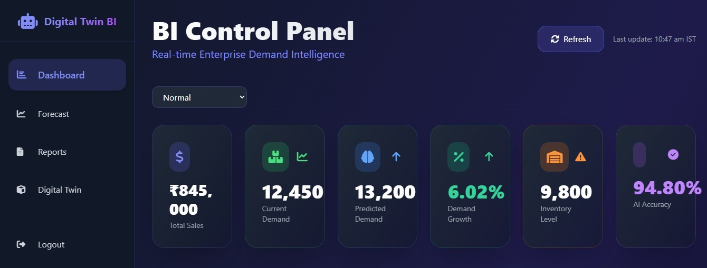
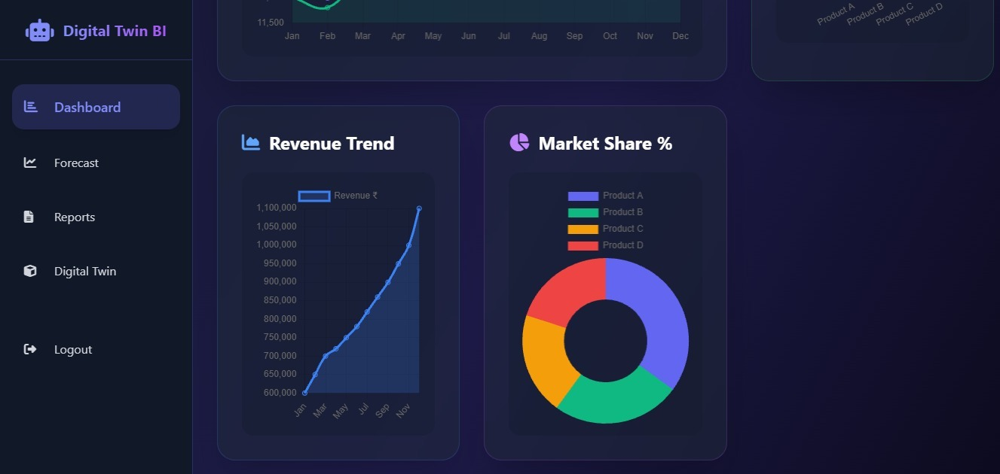
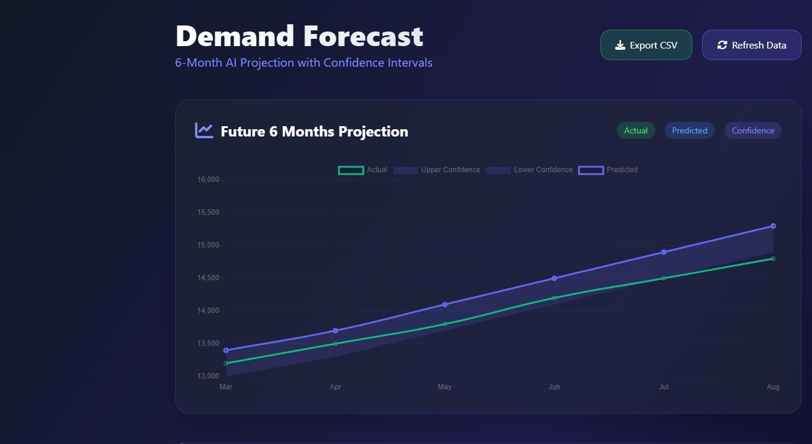
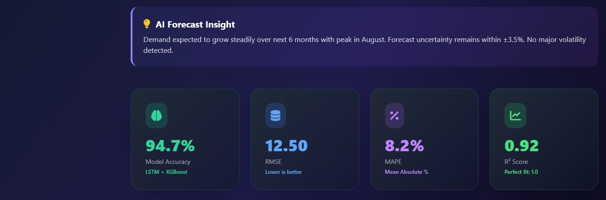
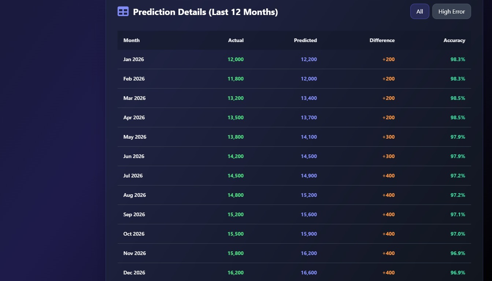
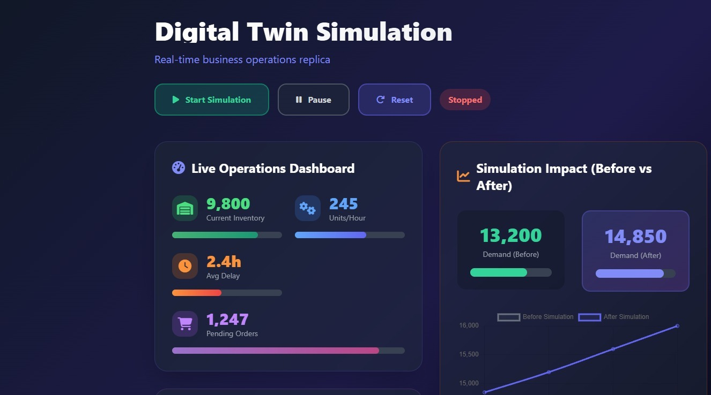
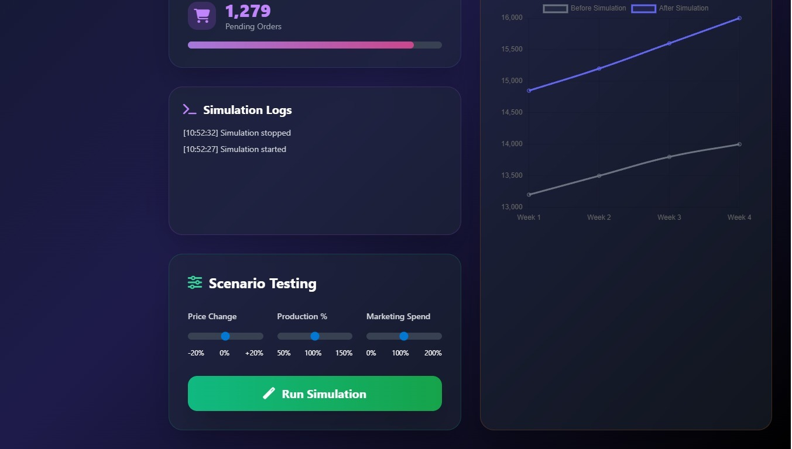
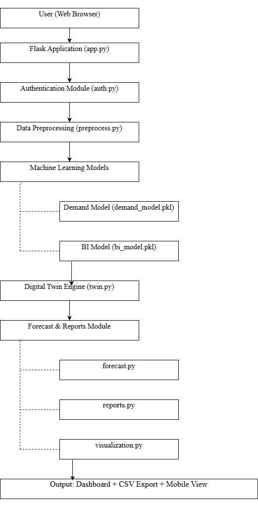

# 🚀 SalesMind DTBI

AI-Based Digital Twin Business Intelligence & Demand Prediction System
   SalesMind DTBI is an AI-powered Business Intelligence platform that integrates Demand Forecasting, Digital Twin Simulation, and What-If Analysis to help businesses make intelligent data-driven decisions.

---

## 🔥 Features
📊 AI-powered Demand Forecasting
🧠 Digital Twin Simulation Engine
🔮 What-If Scenario Analysis
📦 Inventory Intelligence System
🌐 REST API Architecture
🧩 Modular Machine Learning Integration

---

## 🧠 Models Used
- Demand Prediction Model
- Business Intelligence Model
- Digital Twin Simulation Engine

---

## 🛠 Tech Stack
- Python
- Flask
- Machine Learning
- REST APIs
- HTML
- Tailwind CSS
- JavaScript

--

## ▶ How to Run

pip install -r requirements.txt

python app.py

Then open:
    http://127.0.0.1:5000

##📊 System Modules

Dashboard Entry
Login Screen
Control Panel
Dashboard Overview
AI Insights
6-Month Forecast
Alerts
Sales Prediction Details
Reports & Records
Simulation Impact Testing
    

# SalesMind AI - Dashboard

## 🏗 System Architecture

## 🌐 Live Demo
Check out the project here: [Salesmind Digital Twin BI](https://salesmind-dtbi.onrender.com)

📌 About

AI Based Digital Twin Business Intelligence and Demand Prediction System designed to simulate, analyze, and forecast enterprise demand behavior using AI models.

👩‍💻 Author

Nivetha Venkatesh
GitHub: (https://github.com/Nivetha2405)

